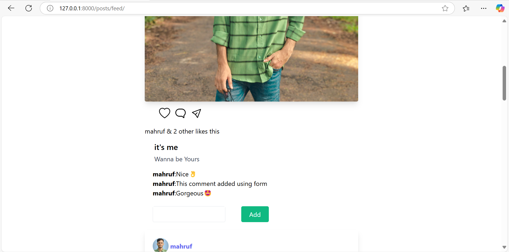

# Instagram Clone (Django Web Application)

## 📖 Project Overview
This is a simple Instagram clone built using Python and the Django web framework. It allows follow other users, like photos, and browse feeds in a user-friendly interface.

## 🚀 Features
- User registration and authentication
- Post creation with image upload
- Like and comment on posts
- User profile pages
- Newsfeed showing posts from followed users

## 🛠 Technologies Used
- **Backend:** Django
- **Frontend:** HTML, CSS, Bootstrap,jQuery,Ajax
- **Database:** SQLite (default Django database)
- **Other Tools:** Pillow (image handling)

## 📸 Screenshots

### Main Interface


### Main Interface


### Main Interface


### Post Creating


### Edit User Profile


### Register User


### Login User


### Admin Panel


## 📦 Installation and Setup

### Prerequisites
Ensure you have the following installed:
- Python 3.8 or higher
- Git
- Virtualenv (optional but recommended)

### Step-by-Step Setup

1. **Clone the Repository:**
   ```bash
   git clone https://github.com/CoderMahruf/Social-App.git
   cd socialproject/
   ```

2. **Create and Activate Virtual Environment:**
   ```bash
   python3 -m venv env
   source env/Scripts/activate   
   ```

3. **Install Dependencies:**
   ```bash
   pip install -r requirements.txt
   ```

4. **Apply Migrations:**
   ```bash
   python manage.py migrate
   ```

5. **Run the Server:**
   ```bash
   python manage.py runserver
   ```

6. **Access the App:**
   Open [http://127.0.0.1:8000](http://127.0.0.1:8000) in your browser.

## 🔍 Project Structure
```
instagram-clone/
├── manage.py
├── db.sqlite3
├── README.md
├── requirements.txt
├── media/    # Stores uploaded media files
├── templates/ # HTML templates for the app
└── app_name/  # Replace with your app's name containing models, views, and urls
```

## 🔧 Usage
- Create an account and log in.
- Start posting images and engaging with other users' posts.

## 🎯 Future Enhancements
- Direct messaging between users
- Stories functionality
- Real-time notifications

## 🤝 Contribution Guidelines
Contributions are welcome! Please follow these steps:
1. Fork the repository.
2. Create a new branch.
3. Make your changes and commit them.
4. Push to your branch and create a pull request.

## 📝 License
This project is licensed under the MIT License. See the LICENSE file for more information.

---

Happy Coding! 🎉
